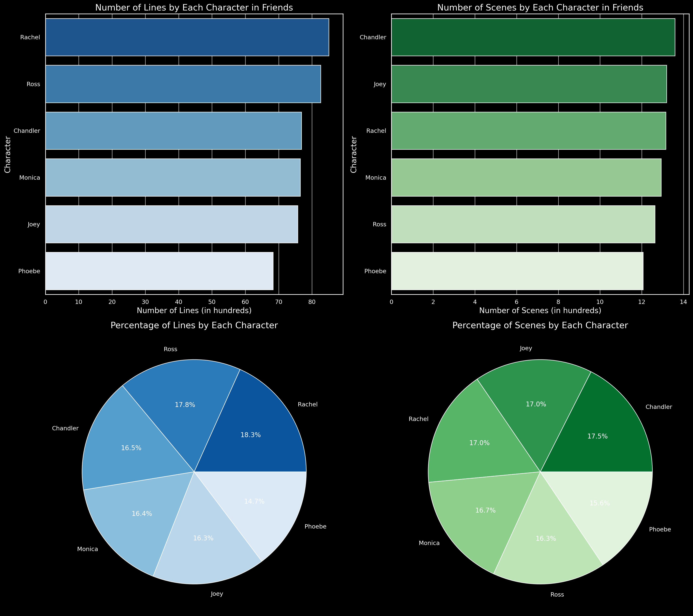
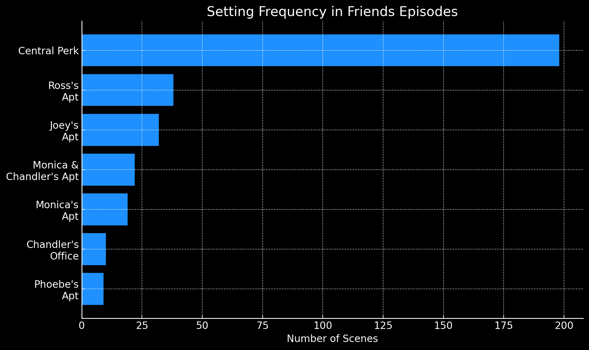
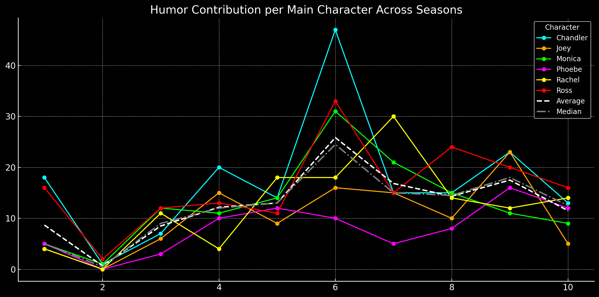

# Table of Context
___
- [Table of Context](#table-of-context)
- [:ab: Introduction](#ab-introduction)
- [:hammer: Tools I used](#hammer-tools-i-used)
- [:mag: Exploratory Data Analysis](#mag-exploratory-data-analysis)
    - [:one: Number of Scenes/ Lines](#one-number-of-scenes-lines)
    - [:two: Setting Frequency](#two-setting-frequency)
    - [:three: Humor](#three-humor)
    - [:four: Common Words Used](#four-common-words-used)
    - [:five: Lexical Diversity](#five-lexical-diversity)
      - [How is Lexical Diversity calculated:](#how-is-lexical-diversity-calculated)
      - [The Findings:](#the-findings)
    - [:six: Sentiment Analysis (with TextBlob)](#six-sentiment-analysis-with-textblob)
      - [How is sentiment determined:](#how-is-sentiment-determined)
      - [How is Polarity Score calculated:](#how-is-polarity-score-calculated)
      - [The Findings:](#the-findings-1)
- [:chart\_with\_upwards\_trend: Correlation Analysis](#chart_with_upwards_trend-correlation-analysis)
    - [:one: Humor-Number of Scenes/Lines Correlation Analysis](#one-humor-number-of-sceneslines-correlation-analysis)
    - [The Findings:](#the-findings-2)
    - [:two: Humor-Lexical Diversity Correlation Analysis](#two-humor-lexical-diversity-correlation-analysis)
    - [The Findings:](#the-findings-3)
    - [:three: Humor-Sentiment Scores Correlation Analysis](#three-humor-sentiment-scores-correlation-analysis)
    - [The Findings:](#the-findings-4)
- [:pencil2: Conclusions](#pencil2-conclusions)
- [:accept: What I Learned](#accept-what-i-learned)

# :ab: Introduction
___
:mega: This project explores screenplay script of the most popular television sitcom [Friends](https://en.wikipedia.org/wiki/Friends) with ChatGPT to provide some inights of the show.  
This project was completed following Luke Barousse's [Youtube tutorial](https://www.lukebarousse.com/chatgpt).

:bar_chart: **Data Source:** [FRIENDS TV Series - Screenplay Script](https://www.kaggle.com/datasets/blessondensil294/friends-tv-series-screenplay-script/data)

:moyai: **AI Disclaimer:** This entire project, except for 'What I Learned' section, was built using ChatGPT, from generating the code for visualizations to producing the text for this markdown file.  

# :hammer: Tools I used
___
- **ChatGPT:** An AI language model that can understand and generate human-like text based on the input it receives. It helps answer questions, write content, and assist with various tasks in natural language.
- **Git & Github:** My go-to for version control and tracking my project progress.

# :mag: Exploratory Data Analysis
___

### :one: Number of Scenes/ Lines
- Rachel: 
    - Leads in number of lines (18.3% of total).
    - Has a strong scene presence (17.0%), indicating a central role in both dialogue and appearances.
- Ross:
    - Close second in number of lines (17.8%), highlighting his role in driving the narrative.
    - Slightly lower in scene appearances (16.3%) compared to Chandler and Joey, indicating that his moments are dialogue-heavy.
- Chandler:
    - Has the highest number of scene appearances (17.5% of total).
    - Contributes 16.5% of total lines, suggesting that although he's often on-screen, he's not always the character with the most dialogue.
- Monica:
    - Has 16.4% of lines and a similar scene presence (16.7%), showing that her role is fairly balanced in both dialogue and screen time.
- Joey:
    - Has 16.3% of total lines and a high scene presence (17.0%).
    - Joey appears often but his dialogue contribution is slightly less than some other characters, which emphasizes his role in group dynamics and interactions.
- Phoebe:
    - Has the fewest lines (14.7%) and least scene appearances (15.6%).
    -Although her contributions are smaller, her quirky and memorable moments stand out, providing quality over quantity.

This shows each character's relative importance in terms of both their dialogue and scene involvement throughout the series.

### :two: Setting Frequency

- **Central Perk** by far the most common setting, with nearly 200 scenes. This suggests that Central Perk is a central social hub for the characters throughout the series.

- **Ross's Apartment and Joey's Apartment** are the next most frequent settings, but they are used much less compared to Central Perk.

- **Monica's Apartment** also feature prominently, reflecting how Monica’s place was one of the primary hangout spots.

- **Chandler's Office and Phoebe's Apartment** are the least featured settings. Chandler’s office is shown infrequently, as his work life is not as central to the storyline. Similarly, Phoebe's apartment is also not as frequently used for major group interactions compared to other settings.

Central Perk serves as the primary social hub. The other prominent locations are the apartments of various characters

### :three: Humor

- **Season 6 Peak**: There is a notable peak in humor contributions in Season 6, with most characters showing increased humor, especially Chandler and Ross.
- **Season 2 Dip**: Humor contributions reach a low point in Season 2, as indicated by almost all characters having a decrease in their humor.
- **Fluctuations Across Seasons**: Chandler and Ross show the most noticeable spikes and declines, while Phoebe, Monica, and Rachel maintain steadier contributions across seasons.

Chandler and Ross are the main drivers of humor throughout the series. Season 6 is a comedic high point for the entire show.

### :four: Common Words Used

- **Most Common Words:** The words "know", "oh", and "okay" are words were frequently used by the main characters.Other notable words include "yeah", "right", "hey", and "like".
- **Conversational Language:** The frequent appearance of words like "know", "oh", "yeah", and "okay" suggests that the characters use a lot of casual conversational fillers.
- **Character References:** The names "ross" and "joey" appear in the word cloud, indicating that the characters often refer to each other by name during conversations. This also implies that Ross and Joey were often talked about or addressed by other characters.
- **Emotional/Exclamatory Words:** Words like "oh", "right", and "hey" point towards a conversational tone filled with emotional or exclamatory expressions, which adds to the comedic timing and dynamics among the characters.
- **Insights on Interaction:** The words are indicative of frequent interactions and responses among characters. For instance, "okay" and "know" likely represent agreement or acknowledgment, showing active back-and-forth exchanges.

The word cloud gives an impression of the casual and interactive nature of dialogue in Friends.

### :five: Lexical Diversity
#### How is Lexical Diversity calculated:

$$
\text{Lexical Diversity} = \frac{\text{Unique Words} }{\text{Total Words}}
$$

The result is a number between 0 and 1. If the number is closer to 1, it means you used lots of different words and had very diverse speech. If the number is lower, it means you repeated a lot of the same words.

#### The Findings:

- **Chandler and Phoebe Lead the Pack:** They use the most varied vocabulary among all main characters. This could indicate that their lines are more unique, perhaps due to their distinct and quirky personalities which tend to bring more nuanced and diverse dialogue to the show.
- **Rachel Falls Below the Averag:** Her vocabulary is the most repetitive compared to others. This might be a reflection of her consistent character arc, personality traits, or the nature of her interactions, which may rely on more common phrases or expressions.
- **Average Lexical Diversity:** Monica, Ross, and Joey hover closer to the average, indicating they have moderately diverse vocabularies, neither too repetitive nor highly varied.

Chandler and Phoebe exceed the average, highlighting their broader word usage, while Rachel falls below it.

### :six: Sentiment Analysis (with TextBlob)
#### How is sentiment determined:
The sentiment is calculated using a tool called TextBlob, which evaluates each line of dialogue and determines whether the sentiment is positive, negative, or neutral. TextBlob calculates something called a polarity score. The polarity score is a number that tells us how positive or negative a sentence is. The score ranges from -1 to 1, with +1 means very positive. -1 means very negative. And 0 means neutral.

#### How is Polarity Score calculated:
$$
\text{Polarity} = \frac{\sum_{i=1}^{n} s_i}{n}
$$

where:

- **si**: Sentiment score of the *i*-th word.
- **n**: Total number of words in the sentence.

Once we have the polarity scores for each line of dialogue:

$$
\text{Average Polarity for Character} = \frac{\sum_{j=1}^{m} \text{Polarity}_j}{m}
$$

where:

- **Polarityj**: The polarity score of the *j*-th line.
- **m**: Total number of lines spoken by the character.

#### The Findings:

    | Character    | Sentiment Score |
    | Phoebe       |            0.099|
    | Rachel       |            0.086|
    | Chandler     |            0.086|
    | Ross         |            0.085|
    | Joey         |            0.082|
    | Monica       |            0.080|

- Phoebe stands out as the most positive character in terms of dialogue, which matches her quirky and optimistic outlook.
- Chandler, despite his sarcastic humor, carries a positive sentiment, suggesting his sarcasm is often lighthearted.
- Monica has the lowest average positivity, reflecting her intense and occasionally critical nature.

# :chart_with_upwards_trend: Correlation Analysis
___
### :one: Humor-Number of Scenes/Lines Correlation Analysis

### The Findings:
- The positive correlation means that characters who are in more scenes or have more lines generally tend to have more humor.
- The wide confidence interval suggests there is still a lot of variability, and while the trend appears to be positive, it is not perfectly consistent across all characters.

Chandler appears to have the strongest presence in terms of both humor and scenes/lines, while Phoebe remains lower in both.

### :two: Humor-Lexical Diversity Correlation Analysis

### The Findings:
- The negative correlation means generally, as lexical diversity increases, humor tends to decrease slightly, but the relationship is not strong.
- The confidence interval indicates a lot of variability, this correlation is not statistically significant, meaning we cannot confidently claim there is a relationship based on this data alone.

The relationship between humor and lexical diversityisn't meaningful, and other factors could be influencing humor frequency.

### :three: Humor-Sentiment Scores Correlation Analysis

### The Findings:
- The negative correlation means a strong negative correlation between sentiment and humor. This means that characters with less positive sentiment tend to make more humorous. Phoebe has a relatively high sentiment score but a low humor, which fits her quirky but not humorous persona. Chandler, known for his sarcasm, has a lower sentiment score and high humor. This suggests that his humor is often delivered with a sarcastic or cynical undertone.
- The confidence interval showing a range of uncertainty around the trend line.

The negative correlation is statistically significant, meaning there's a consistent relationship between lower sentiment scores and humor for these characters.

# :pencil2: Conclusions
___
This project analyzes the popular sitcom Friends, diving into character dynamics, setting preferences, humor trends, and dialogue diversity. Key insights reveal that Rachel leads in lines, Central Perk is the most frequent setting, Chandler and Ross drive humor, and Phoebe maintains the most positive sentiment. The correlation analyses suggest a complex interplay between humor, sentiment, and lexical diversity, highlighting unique character traits like Chandler's sarcastic wit and Phoebe's quirky optimism.

# :accept: What I Learned
___
:fuelpump: **Use ChatGPTas an assistant:** ChatGPT is a powerful tool that can significantly enhance data analysis workflows. To improve the accuracy of its responses, I can customize the model to better align with my specific needs. Crafting a well-structured prompt is crucial; providing clear tasks and context forms the foundation of an effective prompt. Adding details about the desired format and tone further refines the response. Additionally, I should stay vigilant about potential inaccuracies or "hallucinations" from ChatGPT. One way to mitigate this is by including 'search the internet' in the prompt to ensure more reliable information.

:bookmark_tabs: **Know the data I'm working with:** Even though ChatGPT is very powerful, it still has limitations and can sometimes give misleading results because of errors or biases in the data it uses. This is why it's so important for me to understand the dataset I'm working with before starting any analysis. Good data quality is key to getting reliable AI insights, which is why data cleaning is always the first step in the ETL (Extract, Transform, Load) process. By making sure the data is accurate and consistent, I can reduce mistakes and make the results more trustworthy. I also need to stay critical of the results, interpret them carefully, and look out for any possible errors or inconsistencies.

:no_entry_sign: **Avoid web scraping:**  Web scraping is often against the terms and conditions of most websites. Instead, I can access the site's data through official APIs or utilize available public datasets from [Google](https://datasetsearch.research.google.com/), [Reddit](https://www.reddit.com/r/datasets/), [Github](https://www.kaggle.com/) or [Kaggle.](https://www.kaggle.com/)

:school: **Never stop learning:** With so many incredible learning resources available today, and ChatGPT opening new opportunities, continuous learning isn't just an option—it's essential.

