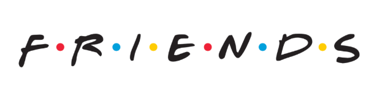

# Introduction
:mega: This project explores screenplay script of the most popular sitcom Friends using ChatGPT. This project was is completed following Luke Barousse's [Youtube tutorial](https://www.lukebarousse.com/chatgpt).

:bar_chart: **Data Source:** [FRIENDS TV Series - Screenplay Script](https://www.kaggle.com/datasets/blessondensil294/friends-tv-series-screenplay-script/data)

:moyai: **AI Disclaimer:** This entire project was built using ChatGPT, from generating the code for visualizations to producing the text for this markdown file.

# Tools I used
- **ChatGPT:**
- **Git & Github:**
# Exploratory Data Analysis
## The Results
# What I Learned
# Conclusions
### Insights
### Closing Thoughts

